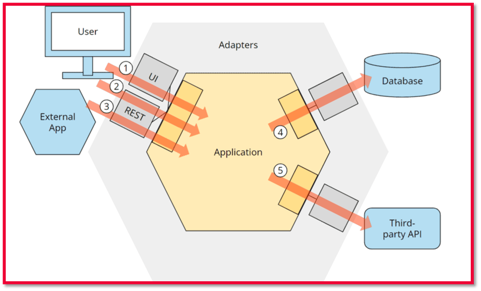
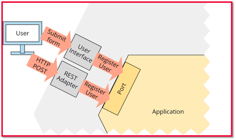
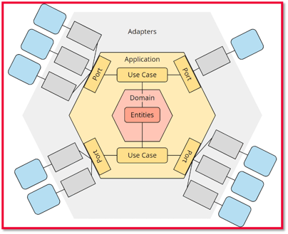
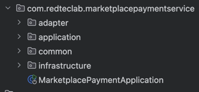
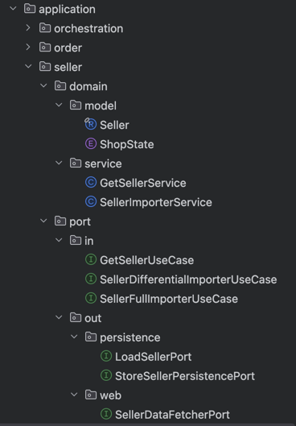
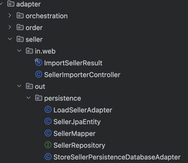

# University Service
This is a sample project applying hexagonal architecture, also known as ports & adapters.

## Hexagonal Architecture Overview
*General Application Overview*

*In-Adapter & In-Port Overview*

*Detailed Application Overview*

> Source: https://www.happycoders.eu/software-craftsmanship/hexagonal-architecture/

## Example (target) project structure
*General Project Structure*

- common
  - Classes used across the application, but not considered infrastructure
    - f.e. logging
- infrastructure
  - mostly configuration classes used inside the application that are valid _globally_ (cross-cutting converns)
    - f.e. classes used to push metrics
  - specific configs are placed inside the in-adapter packages
    - f.e. specific config for a RMQ listener
  

*Application Package // Use-Case with In-Port & Out-Port*

*Adapter Package // In-Adapter & Out-Adapter*

## Starting Point (Guide)
Follow this guide getting first hands-on experience.
- [Guide: Part I - Getting Started](/guide/part-1.md)
- [Guide: Part II](/guide/part-2.md)
- [Guide: Part III](/guide/part-3.md)
- [Guide: Part IV](/guide/part-4.md)

